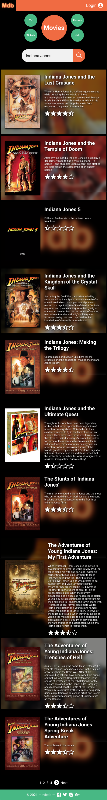
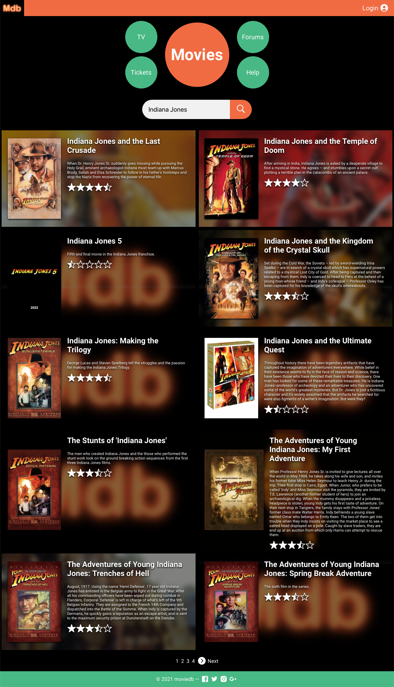
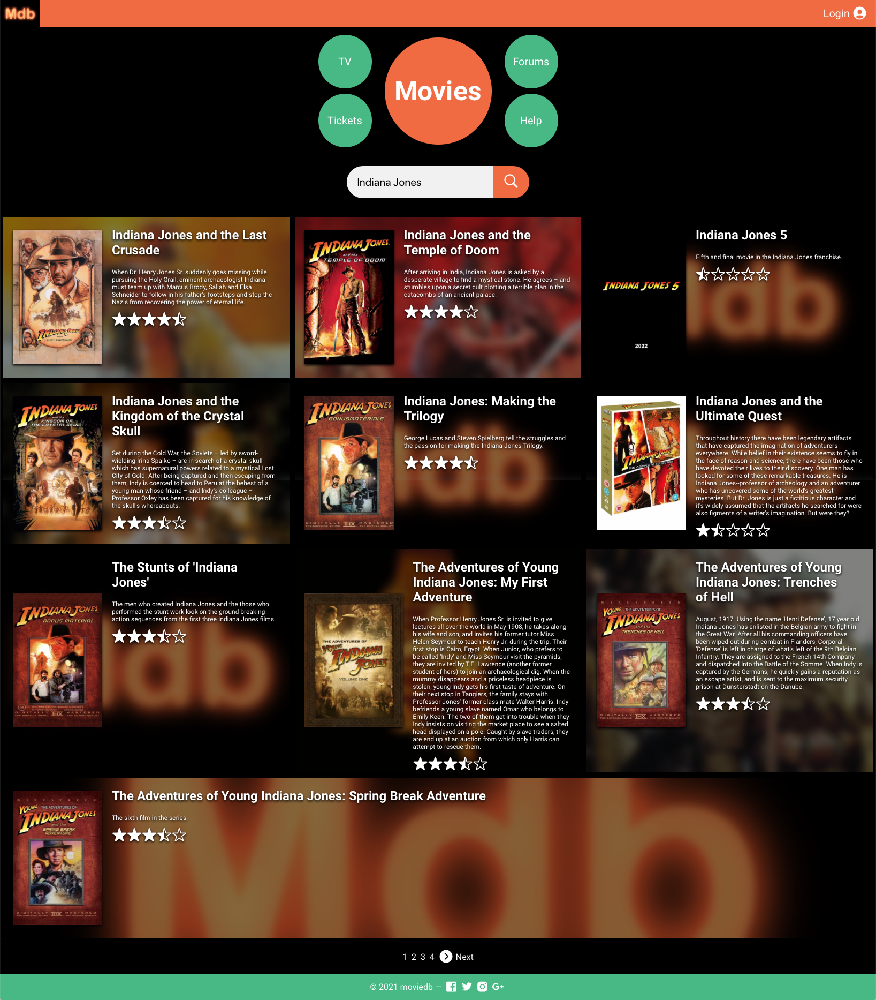
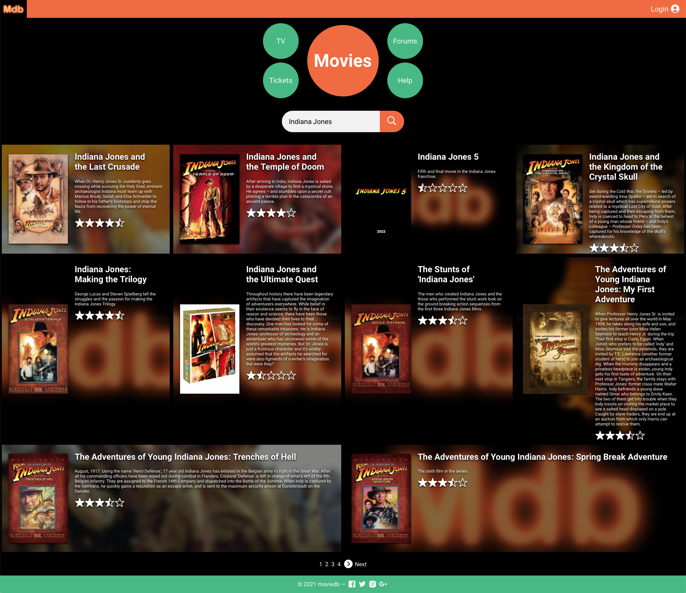

# moviedb

> A Vue.js project

## Installation

1. Download the GitHub repository https://github.com/moscosohd/moviedb
2. Navigate to the `webservice` and `webapp` directories using your system command line
3. Edit `webapp/static/properties.json` using the editor of your preference and add your [TMDB](https://www.themoviedb.org/)'s API key
4. Install dependencies with `npm install` in both webapp and webservice
5. Run the frontend and the server using `npm start` in their respective directories

For a detailed explanation on how things work, check out the [guide](http://vuejs-templates.github.io/webpack/) and [docs for vue-loader](http://vuejs.github.io/vue-loader).

## Screenshots

Small View

Medium View

Large View

XLarge View

